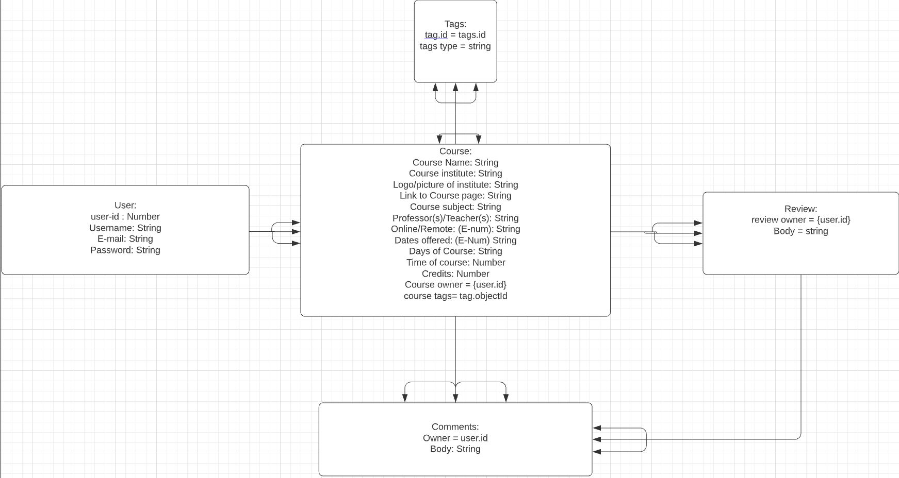

# CourseSearch-API

> Front-end link of project can be found here: https://github.com/Chrislee1996/CourseSearch-Client

# Installation Guide

* Fork and Clone this repo

* Run npm install to install dependencies


# ERD




## Included Routes

| Endpoint          | Action | Description |`AuthenticatedRoute`? | 
|------------------|-------|------|----|
| `/sign-up`        | Create | Saves users signup info| No         |
| `/sign-in`        | Create | Sign-in users session | No |
| `/change-password` | Update | Updates users password | Yes |
| `/course`        | Read | Retrieve Course index page | No|
| `/course/:id`        | Read | Retrieve a specific course | No|
| `/course/mine`        | Read | Retrieve user's created courses | Yes|
| `/course/collegecourses`        | Read | Retrieve college related courses | No|
| `/course/noncollegecourses`        | Read | Retrieve non-college related courses | No|
| `/course/subject`        | Read | Retrieve specific subject of college courses | No|
| `/course`        | Create | Creates a new course | Yes|
| `/course/:id`        | Update | Updates a specific course | Yes|
| `/course/:id`        | Delete | Deletes a specific course | Yes|
| `/attendingcourses`        | Read | Retreives a specific courses that a user adds to their profile | Yes|
| `/attendingcourses`        | Create | Adds a specific courses that a user adds to their profile | Yes|
| `/attendingcourses/:id`        | Create | Deletes a specific courses that a user adds to their profile | Yes|
| `/review/:courseId`        | Post |   Creates a review on a specific course| Yes|
| `/review/:courseId/:reviewId`        | Update |   Updates a  specific review on a specific course| Yes|
| `/review/:courseId/:reviewId`        | Delete |   Deletes a  specific review on a specific course| Yes|
| `/tags`        | Read |   Retrieves index of tags related to a specific course | No|
| `/tags/:id`        | Read |   Retrieves a specific tag related to a specific course | No|
| `/comments/:courseId/:reviewId`        | Create |   Creates a comment to a specific review that was left on a course | Yes|
| `/comments/:courseId/:reviewId/:commentId`        | Delete |   Deletes a specific comment to a specific review that was left on a course | Yes|


### Authentication

| Verb   | URI Pattern            | Controller#Action |
|--------|------------------------|-------------------|
| POST   | `/sign-up`             | `users#signup`    |
| POST   | `/sign-in`             | `users#signin`    |
| PATCH  | `/change-password/` | `users#changepw`  |
| DELETE | `/sign-out/`        | `users#signout`   |

#### POST /sign-up

Request:

```sh
curl --include --request POST http://localhost:8000/sign-up \
  --header "Content-Type: application/json" \
  --data '{
    "credentials": {
      "email": "an@example.email",
      "password": "an example password",
      "password_confirmation": "an example password"
    }
  }'
```

```sh
curl-scripts/sign-up.sh
```

Response:

```md
HTTP/1.1 201 Created
Content-Type: application/json; charset=utf-8

{
  "user": {
    "id": 1,
    "email": "an@example.email"
  }
}
```

#### POST /sign-in

Request:

```sh
curl --include --request POST http://localhost:8000/sign-in \
  --header "Content-Type: application/json" \
  --data '{
    "credentials": {
      "email": "an@example.email",
      "password": "an example password"
    }
  }'
```

```sh
curl-scripts/sign-in.sh
```

Response:

```md
HTTP/1.1 200 OK
Content-Type: application/json; charset=utf-8

{
  "user": {
    "id": 1,
    "email": "an@example.email",
    "token": "33ad6372f795694b333ec5f329ebeaaa"
  }
}
```

#### PATCH /change-password/

Request:

```sh
curl --include --request PATCH http://localhost:8000/change-password/ \
  --header "Authorization: Bearer $TOKEN" \
  --header "Content-Type: application/json" \
  --data '{
    "passwords": {
      "old": "an example password",
      "new": "super sekrit"
    }
  }'
```

```sh
TOKEN=33ad6372f795694b333ec5f329ebeaaa curl-scripts/change-password.sh
```

Response:

```md
HTTP/1.1 204 No Content
```

#### DELETE /sign-out/

Request:

```sh
curl --include --request DELETE http://localhost:8000/sign-out/ \
  --header "Authorization: Bearer $TOKEN"
```

```sh
TOKEN=33ad6372f795694b333ec5f329ebeaaa curl-scripts/sign-out.sh
```

Response:

```md
HTTP/1.1 204 No Content
```